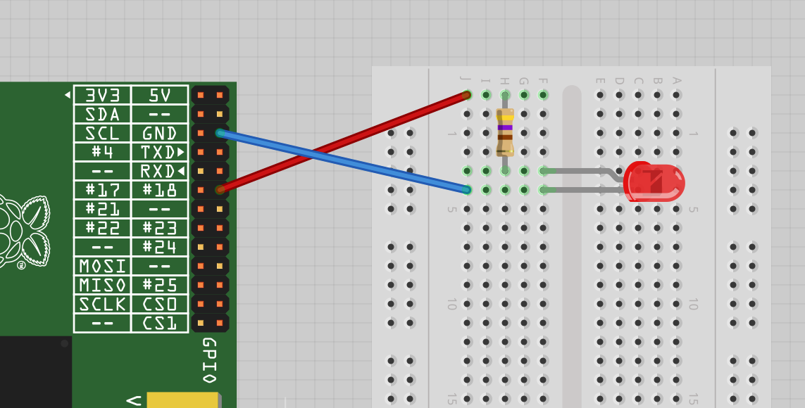

## Requirements
    - simple LED
    - use resistor to avoid burning

You should run this service at startup, ex using cronbtab with screen

install screen service:  
`sudo apt install screen`

edit crontab:   
`crontab -e`

Copy the following line to crontab file:  
`@reboot screen -S statusled -d -m /usr/bin/python ...yourpath.../cpustatus.py`
